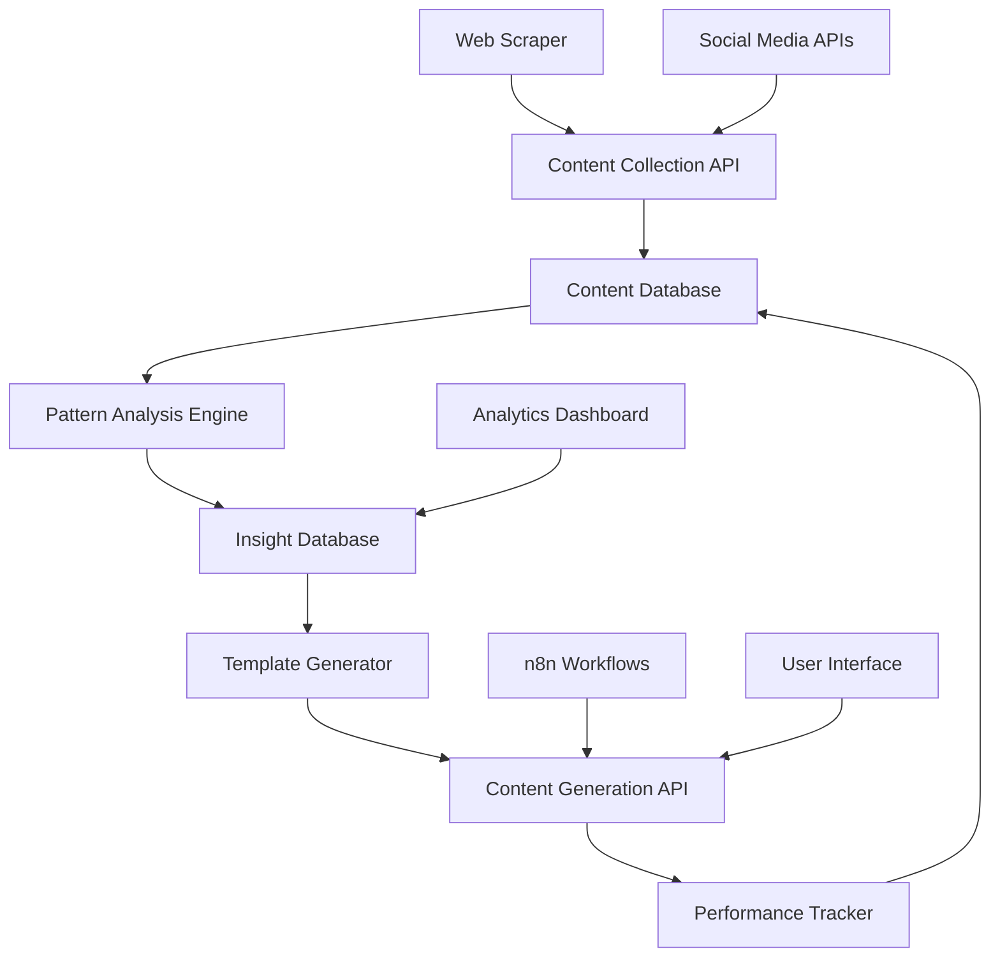

# Viral Content Analyzer - Technical Design

## Overview

The Viral Content Analyzer is a multi-component AI system that combines web scraping, natural language processing, pattern recognition, and content generation to create a comprehensive content optimization platform. The system learns from high-performing social media content and applies those insights to generate engaging posts and threads.

## Architecture

### High-Level Architecture



### Component Architecture

**Data Layer:**
- **Content Database:** PostgreSQL with full-text search for posts, metadata, and engagement data
- **Insight Database:** Vector database (Pinecone/Chroma) for pattern embeddings and similarity search
- **Cache Layer:** Redis for frequently accessed patterns and generated content

**Processing Layer:**
- **Content Collector:** Async workers for scraping and API integration
- **Pattern Analyzer:** ML pipeline using spaCy, transformers, and custom algorithms
- **Content Generator:** LangGraph agents with specialized roles for different content types

**API Layer:**
- **FastAPI backend** with async endpoints for all operations
- **WebSocket connections** for real-time progress updates
- **REST APIs** for n8n and external tool integration

## Components and Interfaces

### 1. Content Collection Service

**Purpose:** Collect and normalize content from multiple social platforms

**Key Classes:**
```python
class ContentCollector:
    def collect_linkedin_post(self, url: str) -> LinkedInPost
    def collect_twitter_thread(self, url: str) -> TwitterThread
    def batch_collect(self, urls: List[str]) -> List[SocialPost]
    
class SocialPost:
    platform: str
    content: str
    author: str
    engagement_metrics: EngagementData
    metadata: Dict[str, Any]
    collected_at: datetime
```

**APIs:**
- `POST /api/content/collect` - Single URL collection
- `POST /api/content/batch-collect` - Batch URL processing
- `GET /api/content/status/{job_id}` - Collection job status

### 2. Pattern Analysis Engine

**Purpose:** Analyze collected content to identify engagement patterns

**Key Classes:**
```python
class PatternAnalyzer:
    def analyze_structure(self, posts: List[SocialPost]) -> StructuralPatterns
    def identify_hooks(self, posts: List[SocialPost]) -> HookPatterns
    def extract_emotional_triggers(self, posts: List[SocialPost]) -> EmotionalPatterns
    
class EngagementPredictor:
    def train_model(self, training_data: List[SocialPost])
    def predict_engagement(self, content: str) -> EngagementPrediction
```

**APIs:**
- `POST /api/analysis/run` - Trigger pattern analysis
- `GET /api/analysis/patterns` - Retrieve identified patterns
- `POST /api/analysis/predict` - Predict content engagement

### 3. Template Generation System

**Purpose:** Create reusable content templates based on successful patterns

**Key Classes:**
```python
class TemplateGenerator:
    def generate_templates(self, patterns: PatternSet) -> List[ContentTemplate]
    def customize_for_niche(self, templates: List[ContentTemplate], niche: str) -> List[ContentTemplate]
    
class ContentTemplate:
    template_type: str  # story, list, framework, question
    structure: TemplateStructure
    hook_patterns: List[str]
    cta_patterns: List[str]
    success_examples: List[SocialPost]
```

**APIs:**
- `GET /api/templates` - List available templates
- `GET /api/templates/{type}` - Get templates by type
- `POST /api/templates/customize` - Customize templates for specific use case

### 4. Content Generation Engine

**Purpose:** Generate optimized content using LangGraph agents

**Agent Architecture:**
```python
class ContentGenerationWorkflow:
    def __init__(self):
        self.idea_analyzer = IdeaAnalyzerAgent()
        self.linkedin_generator = LinkedInGeneratorAgent()
        self.twitter_generator = TwitterGeneratorAgent()
        self.optimizer = ContentOptimizerAgent()
        
    def generate_content(self, idea: str, platform: str) -> GeneratedContent
```

**APIs:**
- `POST /api/generate/linkedin` - Generate LinkedIn post
- `POST /api/generate/twitter` - Generate Twitter thread
- `POST /api/generate/multi-platform` - Generate for multiple platforms

### 5. Performance Tracking System

**Purpose:** Track published content performance and improve recommendations

**Key Classes:**
```python
class PerformanceTracker:
    def track_published_content(self, content: GeneratedContent, metrics: EngagementData)
    def analyze_performance_trends(self) -> PerformanceTrends
    def update_model_weights(self, performance_data: List[PerformanceRecord])
```

**APIs:**
- `POST /api/performance/track` - Submit performance data
- `GET /api/performance/trends` - Get performance analytics
- `POST /api/performance/feedback` - Provide content feedback

## Data Models

### Core Data Models

```python
class SocialPost(BaseModel):
    id: UUID
    platform: str
    url: str
    content: str
    author: str
    published_at: datetime
    collected_at: datetime
    engagement_metrics: EngagementMetrics
    analysis_results: Optional[AnalysisResults]

class EngagementMetrics(BaseModel):
    likes: int
    comments: int
    shares: int
    views: Optional[int]
    engagement_rate: float
    
class AnalysisResults(BaseModel):
    hook_type: str
    content_structure: str
    emotional_triggers: List[str]
    topic_categories: List[str]
    readability_score: float
    predicted_engagement: float

class ContentTemplate(BaseModel):
    id: UUID
    name: str
    template_type: str
    structure_pattern: str
    hook_templates: List[str]
    cta_templates: List[str]
    success_rate: float
    niche_tags: List[str]

class GeneratedContent(BaseModel):
    id: UUID
    original_idea: str
    platform: str
    generated_text: str
    template_used: UUID
    patterns_applied: List[str]
    predicted_engagement: float
    actual_performance: Optional[EngagementMetrics]
```

### Database Schema

**Posts Table:**
- Primary storage for collected social media content
- Full-text search indexes on content
- Composite indexes on platform + engagement metrics

**Patterns Table:**
- Identified patterns with confidence scores
- Vector embeddings for similarity search
- Performance correlation data

**Templates Table:**
- Generated templates with usage statistics
- Version control for template evolution
- Niche-specific customizations

**Generated Content Table:**
- Track all generated content and performance
- Link to source templates and patterns
- Feedback and improvement data

## Error Handling

### Content Collection Errors
- **Rate Limiting:** Implement exponential backoff and queue management
- **Invalid URLs:** Validate and sanitize input URLs before processing
- **Platform Changes:** Graceful degradation when scraping patterns change
- **Network Issues:** Retry logic with circuit breaker pattern

### Analysis Errors
- **Insufficient Data:** Minimum thresholds for pattern confidence
- **Model Failures:** Fallback to rule-based analysis when ML models fail
- **Data Quality:** Validation and cleaning of collected content
- **Performance Issues:** Async processing with progress tracking

### Generation Errors
- **Template Failures:** Multiple template options with fallbacks
- **API Limits:** Queue management for OpenAI API calls
- **Quality Control:** Content validation before delivery
- **User Feedback:** Continuous learning from generation failures

## Testing Strategy

### Unit Testing
- **Content Collectors:** Mock social media APIs and test parsing logic
- **Pattern Analyzers:** Test with known high/low performing content samples
- **Template Generators:** Validate template structure and customization
- **Content Generators:** Test agent workflows with various input types

### Integration Testing
- **End-to-End Workflows:** From URL collection to content generation
- **API Testing:** All endpoints with various input scenarios
- **Database Integration:** Data consistency and performance testing
- **External Service Integration:** Social media APIs and n8n workflows

### Performance Testing
- **Load Testing:** Handle 1000+ concurrent content collection requests
- **Analysis Performance:** Pattern analysis completes within 30 seconds
- **Generation Speed:** Content generation under 10 seconds
- **Database Performance:** Query optimization for large content datasets

### User Acceptance Testing
- **Content Quality:** Generated content meets engagement expectations
- **Workflow Usability:** Intuitive interface for content creators
- **Pattern Accuracy:** Identified patterns correlate with actual performance
- **Learning Effectiveness:** System improves over time with usage

## Deployment Architecture

### Development Environment
- **Local Development:** Docker Compose with all services
- **Database:** PostgreSQL + Redis containers
- **External Services:** Mock APIs for social media platforms

### Production Environment
- **Container Orchestration:** Kubernetes or Docker Swarm
- **Database:** Managed PostgreSQL (AWS RDS) + Redis cluster
- **API Gateway:** Rate limiting and authentication
- **Monitoring:** Prometheus + Grafana for system metrics
- **Logging:** Centralized logging with ELK stack

### Scaling Considerations
- **Horizontal Scaling:** Stateless API services behind load balancer
- **Database Scaling:** Read replicas for analytics queries
- **Queue Management:** Redis/RabbitMQ for async job processing
- **Caching Strategy:** Multi-level caching for frequently accessed data

## Security Considerations

### Data Protection
- **Content Privacy:** Respect platform terms of service and user privacy
- **API Security:** Rate limiting and authentication for all endpoints
- **Data Encryption:** Encrypt sensitive data at rest and in transit
- **Access Control:** Role-based access to different system components

### Compliance
- **GDPR Compliance:** Data retention policies and user consent
- **Platform Terms:** Respect social media platform scraping policies
- **Content Rights:** Ensure generated content doesn't violate copyrights
- **User Data:** Secure handling of user-generated content and feedback

This design provides a comprehensive foundation for building a production-ready viral content analyzer that can significantly improve content creation effectiveness while maintaining scalability and reliability.